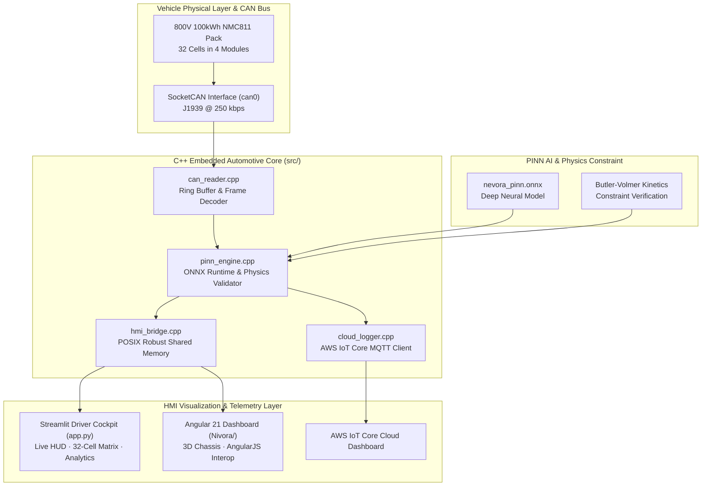

<div align="center">

# ⚡ NEVORA
### **Physics-Informed Neural Network (PINN) 800V EV Battery Digital Twin & BMS Intelligence**

[](https://www.python.org/)
[](https://isocpp.org/)
[](https://onnxruntime.ai/)
[](https://streamlit.io/)
[](https://angular.dev/)
[](https://www.docker.com/)

<p align="center">
  <b>A real-time edge-embedded battery management intelligence system combining Butler-Volmer electrochemical kinetics, deep neural state estimation, SocketCAN J1939 telemetry, and high-fidelity driver cockpits.</b>
</p>

[Key Features](#-key-features) • [Architecture](#-system-architecture) • [Quickstart](#-quickstart) • [Mathematical Foundation](#-mathematical--physics-foundation) • [Deployment](#-cloud-deployment)

---

</div>

## 📌 Executive Summary

Modern Electric Vehicle (EV) Battery Management Systems (BMS) rely on either empirical lookup tables (fast, but inaccurate under thermal stress) or full electrochemical finite-element models (accurate, but too computationally expensive for real-time edge microcontrollers).

**NEVORA** bridges this gap using **Physics-Informed Neural Networks (PINN)**:
- Evaluates real-time **State of Health (SOH)**, **Remaining Useful Life (RUL)**, and **Degradation Risk** in **< 4.5 ms**.
- Constrains deep neural outputs within the theoretical boundaries of **Butler-Volmer electrochemical kinetics**, preventing unrealistic predictions during extreme acceleration, regenerative braking, or thermal runaway.
- Provides a full end-to-end stack: embedded automotive **C++ SocketCAN engine**, **AWS IoT MQTT cloud logger**, **POSIX shared memory IPC**, and **responsive HMI cockpits** (Streamlit & Angular 21).

---

## ⚡ Key Features

- **🧠 Edge PINN ONNX Co-Processor**: Real-time evaluation of `nevora_pinn.onnx` with normalized multi-channel telemetry ($V/800$, $(I+1000)/2000$, $(T+40)/120$, $SoC/100$).
- **⚖️ Butler-Volmer Physics Enforcement**: Mathematical verification of overpotential kinetics $\frac{0.5 F \eta}{R T_K}$ with deterministic fallback degradation dynamics.
- **🏎️ Dual-Theme Driver Instrument Cluster (HUD)**:
  - **☀️ Driver Daylight Mode**: High-contrast, crisp white cockpit UI engineered for daylight road legibility.
  - **🌙 Night Cockpit Mode**: Midnight dark UI with glowing cyan neon telemetry for reduced nighttime glare.
- **🔋 32-Cell Series-Parallel Matrix**: 4 Modules (`MOD-A`, `MOD-B`, `MOD-C`, `MOD-D`) displaying individual cylindrical cell voltage ($V$), thermal gradients (°C), internal impedance ($m\Omega$), and active balancing shunts.
- **🚨 Fault & Thermal Runaway Injection**: Interactive testbench injecting localized thermal surge (54.2°C) and voltage sag (3.38V) on Cell #14 to prove PINN anomaly detection before hardware BMS trip.
- **📡 Real-Time CAN Bus Decoder**: Decodes simulated SAE J1939 frames (`0x18F00101` for $V/I$ telemetry and `0x18F00201` for Thermal state).
- **☁️ Cloud & IPC Pipelines**: POSIX robust shared memory (`/nevora_bms_shm`) and AWS IoT MQTT cloud synchronization.

---

## 🏗️ System Architecture



---

## 📐 Mathematical & Physics Foundation

### 1. Butler-Volmer Electrochemical Kinetics

The electrochemical charge transfer across the electrode-electrolyte interface is governed by the Butler-Volmer relation:

$$j = j_0 \left[ \exp\left( \frac{\alpha_a F \eta}{R T_K} \right) - \exp\left( -\frac{\alpha_c F \eta}{R T_K} \right) \right]$$

Where:
- $F = 96485.33212 \text{ C/mol}$ (Faraday constant)
- $R = 8.314462618 \text{ J/(mol}\cdot\text{K)}$ (Universal gas constant)
- $\eta = \frac{I}{1000.0}$ (Normalized electrochemical overpotential)
- $T_K = T_{\text{core}} + 273.15 \text{ K}$ (Thermodynamic temperature)

In `src/pinn_engine.cpp` and `app.py`, the physics validator guarantees:
$$\left| \frac{0.5 \cdot F \cdot \eta}{R \cdot T_K} \right| < 30.0 \quad \text{and} \quad 233.15\text{ K} < T_K < 373.15\text{ K}$$

### 2. Dual-Stress Degradation Tensor

If neural inference violates physical constraints or sensor packet drops exceed threshold, the system shifts to a deterministic degradation tensor:

$$\text{Stress}_{\text{thermal}} = \text{clamp}\left(\frac{T - 35.0}{45.0}, 0, 1\right)$$
$$\text{Stress}_{\text{current}} = \text{clamp}\left(\frac{|I|}{1000.0}, 0, 1\right)$$
$$\text{SOH} = \text{clamp}\left(\text{SOC} - 12.0 \cdot \text{Stress}_{\text{thermal}} - 5.0 \cdot \text{Stress}_{\text{current}}, 0, 100\right)$$
$$\text{Risk}_{\text{degradation}} = 0.65 \cdot \text{Stress}_{\text{thermal}} + 0.35 \cdot \text{Stress}_{\text{current}}$$

---

## 📂 Project Structure

```
├── .streamlit/
│   └── config.toml             # Streamlit server & theme definitions
├── include/                    # C++ Header files
│   ├── can_reader.hpp          # SocketCAN reader interface
│   ├── cloud_logger.hpp        # AWS IoT MQTT client interface
│   ├── hmi_bridge.hpp          # POSIX shared memory layout (/nevora_bms_shm)
│   └── pinn_engine.hpp         # ONNX PINN inference engine header
├── Nivora/                     # Angular 21 Enterprise HMI Dashboard
│   ├── src/app/                # Battery dashboard components, styles & logic
│   └── package.json            # Node dependencies
├── src/                        # C++ Automotive Core Implementation
│   ├── can_reader.cpp          # Real-time CAN frame parser
│   ├── cloud_logger.cpp        # Cloud telemetry publisher
│   ├── hmi_bridge.cpp          # Shared memory publisher
│   ├── pinn_engine.cpp         # Physics-informed ONNX runtime inference
│   └── main.cpp                # Native orchestrator entrypoint
├── app.py                      # Streamlit Driver Cockpit & PINN Digital Twin
├── CMakeLists.txt              # C++ native CMake build configuration
├── Dockerfile                  # Multi-stage production container build
├── nevora_pinn.onnx            # Trained PINN model weights
├── nevora_pinn.onnx.data       # Extended ONNX tensor weights
├── requirements.txt            # Python dependencies (Streamlit, ONNX Runtime, Plotly)
├── run_streamlit.bat           # 1-Click Windows execution launcher
└── README.md                   # Project documentation
```

---

## 🚀 Quickstart

### 1. Launch the Streamlit Driver Cockpit

Ensure Python 3.10+ is installed:

```bash
# Clone the repository
git clone https://github.com/KAUSHIK-G-19/NEVORA.git
cd NEVORA

# Install dependencies
pip install -r requirements.txt

# Run the Driver Cockpit
streamlit run app.py
```
*Windows users can simply double-click [`run_streamlit.bat`](run_streamlit.bat).*

Access the dashboard at **`http://localhost:8501`**.

---

### 2. Run the Angular 21 HMI Dashboard

```bash
cd Nivora
npm install
npm start
```
Access the Angular dashboard at **`http://localhost:4200`**.

---

### 3. Build the C++ Automotive Core (Linux / Embedded aarch64)

```bash
mkdir build && cd build
cmake .. -DONNXRUNTIME_ROOT=/usr/local/onnxruntime -DPAHO_MQTT_CPP_ROOT=/usr/local
cmake --build . -j$(nproc)
./nevora_battery
```

---

## 🐳 Docker Deployment

Deploy seamlessly to any container platform (AWS ECS, Google Cloud Run, Render, Azure):

```bash
# Build the Docker image
docker build -t nevora-bms .

# Run the containerized dashboard
docker run -d -p 8501:8501 --name nevora-app nevora-bms
```

---

## ☁️ Cloud Deployment

### Deploy to Streamlit Community Cloud (Free & Instant)
1. Fork or push this repository to GitHub: `https://github.com/KAUSHIK-G-19/NEVORA.git`
2. Navigate to [share.streamlit.io](https://share.streamlit.io) and link your GitHub account.
3. Select your repository, specify branch `main`, and set **Main file path** to `app.py`.
4. Click **Deploy!**

---

## 📊 Operating Drive Modes

| Mode | Pack Current | Nominal Volts | Thermal Demand | Description |
| :--- | :--- | :--- | :--- | :--- |
| **🚗 Dynamic Drive** | `-24.8 A` | `401.8 V` | `14.5 L/min` | Standard highway cruising load profile |
| **⚡ DC Fast Charge** | `+118.5 A` | `412.0 V` | `18.2 L/min` | High-current CC-CV fast charging |
| **🚀 Ludicrous Sport** | `-186.2 A` | `384.2 V` | `24.0 L/min` | Peak discharge acceleration with voltage sag |
| **🔄 Regenerative Eco** | `+38.4 A` | `405.2 V` | `14.5 L/min` | Kinetic deceleration energy recovery |
| **⚖️ Cell Balancer** | `-1.2 A` | `400.0 V` | `14.5 L/min` | Passive shunting & module equalization |

---

## 📜 License & Acknowledgments

This project is licensed under the **MIT License**.

Developed for advanced electric powertrain research, edge AI co-processing, and physics-informed battery intelligence.
